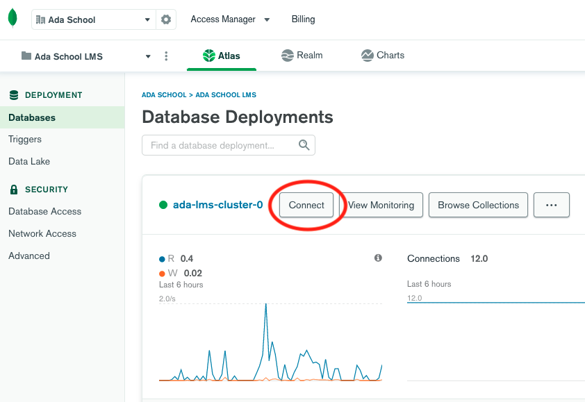
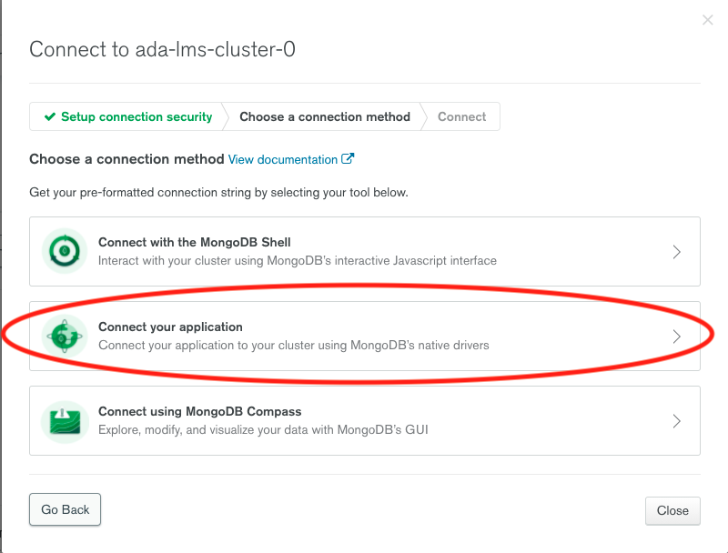
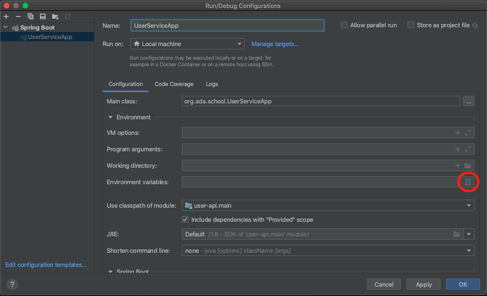

## Goals

- Explain what MongoDB is.
- Explain the difference between SQL and NoSQL.
- Create a MongoDB Cluster on Atlas.
- Connect your Spring Boot project with a MongoDB Cluster.

## Main Topics

* NoSQL.
* MongoDB.
* Cluster.


## Codelab 🧪
### Part 1: Creating your Atlas account and first cluster:

If you haven't created your MongoDB Cluster follow part 1 - 4:

* [Get Started with Atlas](https://docs.atlas.mongodb.com/getting-started/)

### Part 2: Connecting my MongoDB Cluster with Spring Boot

1. Login into your [MongoDB Atlas account](https://account.mongodb.com/account/login)
2. Click *connect* on the cluster you created on Part 1:
   
3. Select *Connect your application*:
   
4. Choose the *Java* driver, select the latest version and copy the *connection string*:
   
5. Replace the *password* on the *connection string* with the password used when creating your database user.
6. Add an *Environment Variable* to the *application.properties* file to store the MongoDB URI:
    ````properties
    spring.data.mongodb.uri=${MONGODB_URI}
    ````
7. Add the environment variable to IntelliJ Idea by editing the Run/Debug Configurations:
   
   
   
   
7. Add the Spring Boot starter data MongoDB dependency to your *build.gradle*:
    ```groovy
       dependencies {
            implementation 'org.springframework.boot:spring-boot-starter-web'
            implementation 'org.springframework.boot:spring-boot-starter-data-mongodb'
            testImplementation 'org.springframework.boot:spring-boot-starter-test'
        }
    ```
8. Run your project and verify that the connection is successful.

#### Verificacion de conexión a cluster en Atlas MongoDB


9. To avoid future problems connecting to your Atlas instance (because of ip whitelist) find the way to allow connections from any Ip (not recommended for real-world applications)

### Part 3: Implementing the MongoDB Service

1. Create a new package called *repository*.
2. Modify your current **User** class to use MongoDB notations:

    ```java
      import org.springframework.data.annotation.Id;
      import org.springframework.data.mongodb.core.index.Indexed;
      import org.springframework.data.mongodb.core.mapping.Document;
      
      import java.util.Date;
      
      @Document
      public class User
      {
         @Id
         String id;
      
         String name;
      
         @Indexed( unique = true )
         String email;
      
         String lastName;
      
         Date createdAt;
      
         public User()
         {
         }
      }
   
     ```
3. Create a new interface called *UserRepository* inside the repository package:
    ```java
      import org.springframework.data.mongodb.repository.MongoRepository;
      
      public interface UserRepository extends MongoRepository<User, String>
      {}
     ```
4. Create a new *UserService* implementation called *UserServiceMongoDB* and inject inside the *UserRepository*:

      ```java
         import java.util.List;
         
         public class UserServiceMongoDB
         implements UserService
         {
         
             private final UserRepository userRepository;
         
             public UserServiceMongoDB(@Autowired UserRepository userRepository )
             {
                 this.userRepository = userRepository;
             }
         
             @Override
             public User create( User user )
             {
                 return null;
             }
         
             @Override
             public User findById( String id )
             {
                 return null;
             }
         
             @Override
             public List<User> all()
             {
                 return null;
             }
         
             @Override
             public boolean deleteById( String id )
             {
                 return false;
             }
         
             @Override
             public UserDto update( User user, String id )
             {
                 return null;
             }
         }
    ```

5. Implement the methods of the *UserServiceMongoDB* using the *UserRepository*.
6. Remove the *@Service* annotation from the *UserServiceHashMap* and add it to the *UserServiceMongoDB*.
7. Test your API and verify that your data is stored in your cluster.

### Pruebas MONGODB en usuarios
### Insercion de Usuario


### Traer todos los usuarios (Contexto: Se crea otro usuario para ver de mejor manera la correcta ejecución)


### Encontrar usuario por identificador (ID)


### Actualización de usuario

#### Se realiza una búsqueda de todos los usuarios para ver si se actualizó de manera correcta el usuario


### Eliminación de usuario

#### Se realiza una búsqueda de todos los usuarios para ver si se eliminó de manera correcta el usuario

#### Se revisa la eliminación del usuario en el cluster de Atlas


### Challenge Yourself: Implement complex queries using the Spring Data Query Methods
1. Modify the *UserService* interface adding the following methods:
    ```java
        List<User> findUsersWithNameOrLastNameLike(String queryText);
        
        List<User> findUsersCreatedAfter(Date startDate);
      {}
     ```
 
2.  Add those 2 new mapping methods on the controller.
3. Test your API, verify that queries work. 

### Pruebas QUERY retos
#### Buscar usuario si su nombre o apellido es igual a:


#### Buscar usuario creado despues de una fecha especifica


***Tip***: take a look at the official documentation and learn how to create custom queries with [Spring Data](https://docs.spring.io/spring-data/jpa/docs/current/reference/html/#jpa.query-methods.query-creation)

    
